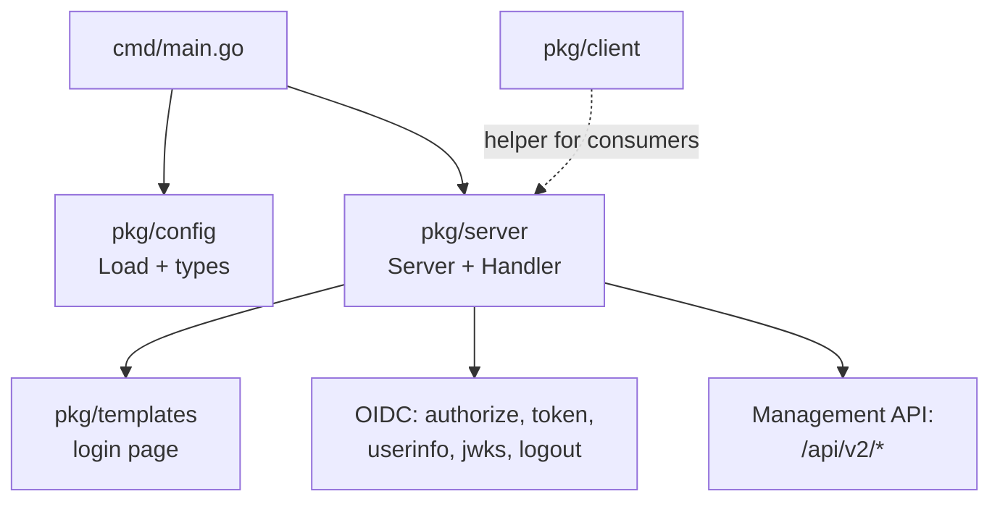

# AGENTS.md

## Project

An OIDC provider and Auth0 Management API mock for local development and tests. It stands in for a
real Auth0 tenant so consumers (notably PEE) can run their auth flows in kind without touching a
live tenant.

Fidelity to real Auth0 is the whole point. A mock that answers 200 where Auth0 answers 400, or that
silently drops a field the SDK sent, is worse than one that is missing the endpoint outright: a
false success turns into a bug found in staging. Prefer refusing a request the way Auth0 refuses it.

## Architecture



All state is in-memory on `Server`, guarded by one `sync.RWMutex`:

- `users`, `organizations`, `connections`, `clients`, `roles`, `members`
- `orgConnections` — the `enabled_connections` pairings
- `invitations` — pending organization invitations, keyed by org id
- `pending`, `authCodes`, `refreshTokens` — login and token state

Reads hand back **copies** (`config.*.Clone()`). Handlers serialize outside the lock while update
handlers mutate under it, so returning a pointer into the store is a data race.

## Setup

```bash
go mod download
```

## Run

```bash
just docker   # container on http://localhost:4646
just kind     # kind + Tilt + ingress + TLS at https://auth.46labs.test
just down     # tear down

go run ./cmd  # directly, reading ./config.yaml
```

Config comes from `config.yaml` (or `/config/config.yaml` in-cluster), overridable by env via viper.
The chart renders every config section it is given; empty sections are omitted.

## Test

```bash
go test -race ./...
golangci-lint run ./...
just ci
```

## Principles

- Library-first: prefer existing packages over custom implementations. Review for duplication.
- No code without a plan. Investigation and implementation are separate steps.
- Own the problem. Never dismiss environment issues.
- Research before action: check current best practices and latest stable versions before making changes.
- Run linters and tests before completing work.

## Code Conventions

### Go

- Match Auth0's wire shapes exactly. Verify against `github.com/auth0/go-auth0/management` rather
  than from memory — the SDK's structs and doc comments are the contract consumers decode with.
- Errors use `writeAuth0Error`, which renders `{statusCode, error, message}`. The SDK decodes that
  into `management.Error`; a bare `{"error": "..."}` still yields the right status but loses the
  message.
- List endpoints must honour `page` and `per_page` through `paginate`. Ignoring them serves page 0
  forever to a caller paging until an empty result.
- Store copies, return copies. Any new record type gets a `Clone`.
- Helpers ending in `Locked` require the caller to hold the mutex; say so in one line.

### Testing

- Great test coverage is a goal, not an afterthought.
- **Drive the Management API through the official SDK**, not raw HTTP. It is the only way to prove
  the wire shapes decode for a real client. Raw HTTP is for the OIDC browser flows the SDK does not
  cover.
- Prove a test catches its bug: revert the fix, watch it fail, restore. A test that passes both ways
  documents nothing.
- Concurrency belongs under `-race` with real goroutines. Single-goroutine tests make `-race` a
  no-op, which is how the unguarded login-state maps survived.
- No sleep-based timing. Backdate timestamps instead of waiting for expiry.

## README Policy

- For human consumption. Concise. No em-dashes. No AI prose.
- Content: what it is, how to set up, how to run, how to test.
- Mermaid diagrams where they help.
- Refreshed at end of implementation cycles before push.

## Specs & Plans

Consumer-driven work arrives as a spec in the consuming repo; this repo implements the mock
requirements section. The tenant onboarding work came from
`pee:docs/superpowers/specs/2026-09-01-tenant-onboarding-invite-first-admin-design.md`.

- Design specs: `docs/specs/YYYY-MM-DD-<topic>-design.md`
- Implementation plans: `docs/plans/YYYY-MM-DD-<feature-name>.md`

## Review Protocol

Specs use a Claude-orchestrated review cycle. Claude owns the document; other agents (Codex, etc.)
are invoked as review oracles.

- Claude drafts and holds the spec. Codex is called via `codex exec` for scoped review passes.
- Codex returns assessments; Claude integrates them. Only Claude writes to disk.
- Marker blocks (git merge conflict syntax with `|||` threads) are **preserved in the final doc** as
  decision records — they are not stripped on finalize.
- Vocabulary: `||| agent [action]` where action is `gap`, `recommend`, `question`, `accept`,
  `accept-partial`, `reject`, or `edit`.
- Record a block when codex input materially changed the outcome. Skip for trivial confirmations.

### Conflict-Marker Tooling

Final specs and plans intentionally contain markers. Exclude `docs/specs/**` and `docs/plans/**`
from conflict-marker checks in pre-commit, CI, and editor diagnostics.

## Notes

- `templates/default.html` is parsed only when the process runs from the repo root; elsewhere the
  inline fallback in `pkg/templates/loader.go` is used. A template helper missing from
  `templateFuncs` fails startup, and the unit tests will not catch it because they run from
  `pkg/server/`. `TestShippedTemplateParsesAndRenders` exists for exactly that.
- Auth0 rejects organization invitations on passwordless connections, so an org needs a
  non-passwordless enabled connection before it can be invited to.
- Invitations carry role **ids**; `app_metadata.org_roles` holds the role **name**. Redemption
  resolves one to the other.
- The role claim reads `app_metadata.org_roles[org_id]`. The flat `app_metadata.role` is legacy and
  scoped to `app_metadata.tenant_id` only.
- `PATCH /api/v2/organizations/{id}` merges metadata where real Auth0 replaces the object. Known
  divergence, not yet fixed.
- The mock never sends email. `send_invitation_email` is accepted and logged.
